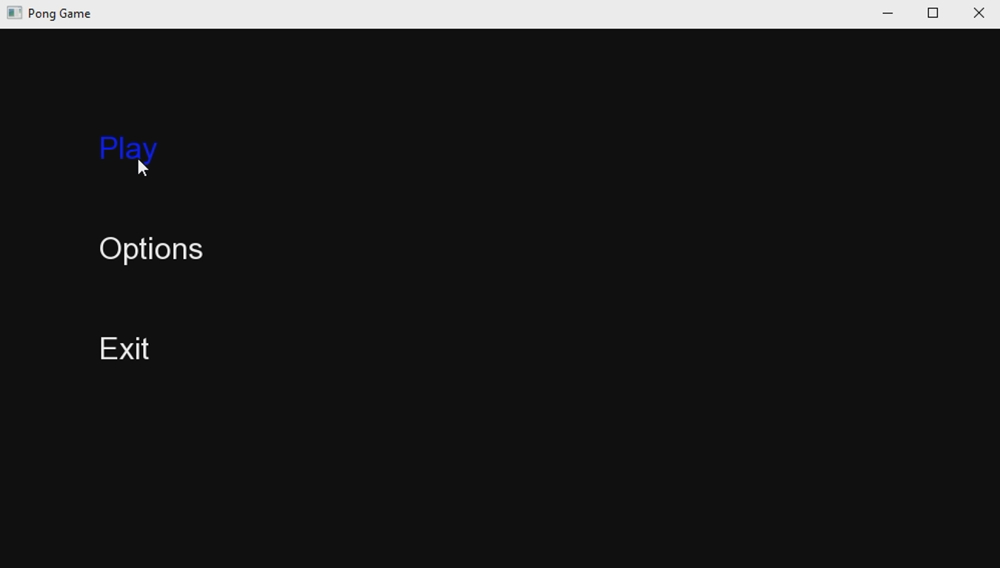
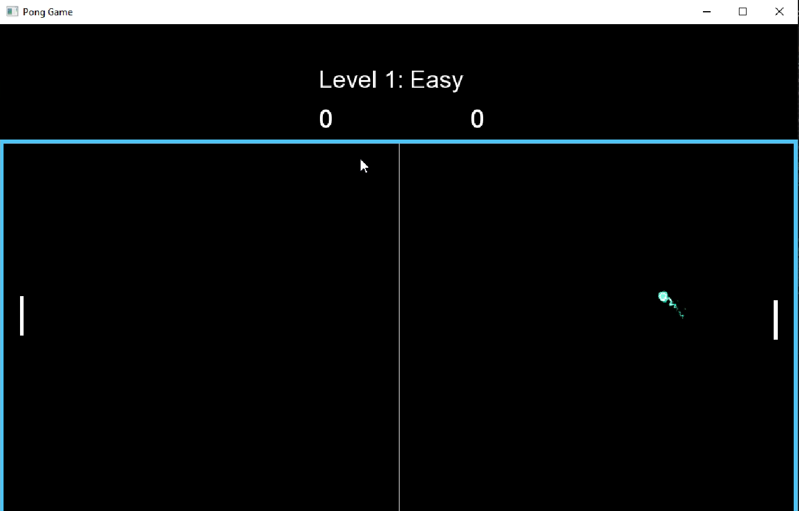
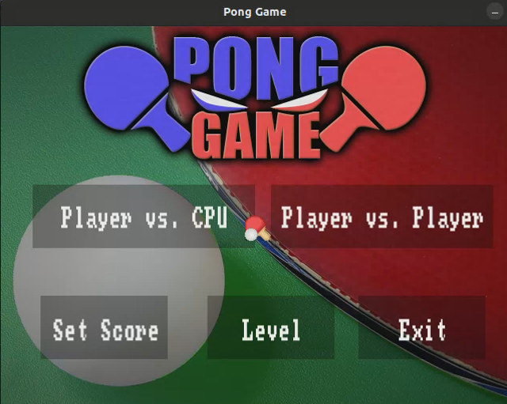
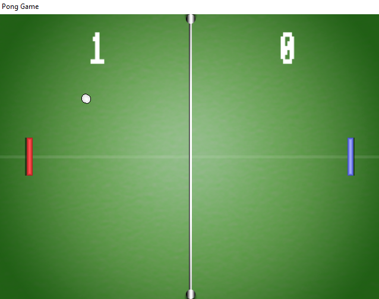

# PINGPONG (SFML game)

## ***About me***

- **Full Name:** Phùng Viết Phú
- **Student ID:** 21020474
- **Course:** 2324H_INT2215_70

## ***Game Introduction***

*PingPong is a classic game that simulates table tennis. Players control a paddle to hit the ball back and forth with an opponent. The objective of the game is to hit the ball in such a way that the opponent cannot return it, thereby scoring points.*

Game introduction video:

## ***How to play***

1. **Starting the Game:** The game begins when one of the two players serves the ball. Players can use control keys (e.g., up/down arrows or W/S keys) to move their paddle.

2. **Controlling the Paddle:** Use the control keys to move the paddle up or down, block the ball, and hit it back towards the opponent.

3. **Scoring Points:** A player scores a point when the ball passes the opponent's paddle and hits the back of the play area. The game ends when one of the players reaches a certain number of points (e.g., 10 points).

4. **Strategy:** Players can change the direction and speed of the ball by hitting it at different positions on their paddle.

Enjoy the game and aim for a high score!

## ***A few images of the game***

- Version 1:
- *Menu*

- *Play*

- Version 2: This version has fixed issues with the ball not running smoothly and has added images and sound to enhance the gameplay experience.

- *Menu*

- *Play*

## ***Game Structure***

The project structure is organized as follows:

- main.cpp:
  
          The main entry point of the game. It initializes the game environment, manages the main game loop, and handles overall game state transitions.

- menu.cpp:
  
          Manages the main menu, including difficulty levels, player selection, game instructions, and the option to quit the game.
- ai.cpp:

          Implements the artificial intelligence (AI) for controlling the opponent paddle, including logic for movement and difficulty levels.

- pongball.cpp:

          Manages the ball's behavior, including movement, collision detection with paddles, walls, and scoring when the ball crosses the screen boundaries.

- background.cpp:

          Manages the background graphics of the game, including loading the image, setting its position, and rendering it to the screen.

- player.cpp:

          Manages the player's paddle, including movement and collision detection with the ball.

- funcs.cpp:

          Contains various utility functions used throughout the game, such as helper functions for calculations, configurations, or other repetitive tasks.

- sound.cpp:

          Manages audio effects in the game, including loading sound files, controlling playback, and adjusting volume.

- window.cpp:

          Responsible for creating and managing the game window, including setting up display parameters, handling window events, and rendering game graphics.        
        

## ***Installation Instructions***

- Step 1 :  Download the file to your computer.

- Step 2 : Extract the contents of the file.

- Step 3 : Locate the `pong.exe` file, open it, and enjoy the game.

## ***Techniques Used***

 - Utilized several features in SFML: image processing, collision detection, movement, text rendering, sound, timing, mouse and keyboard handling, etc.

 - Employed various classes, vectors, arrays, variables, file separation, operator overloading, etc.

 - Created character, monster objects, and buttons.

 - Used Photoshop to edit some images as needed.

 - Created custom menus and buttons by displaying frames and overlaying text.

 - Applied mathematical and physical knowledge to calculate cooldown times, velocities, and the direction of monster movements following the character, etc.

 - Separated files and used a state machine.

## ***References***

